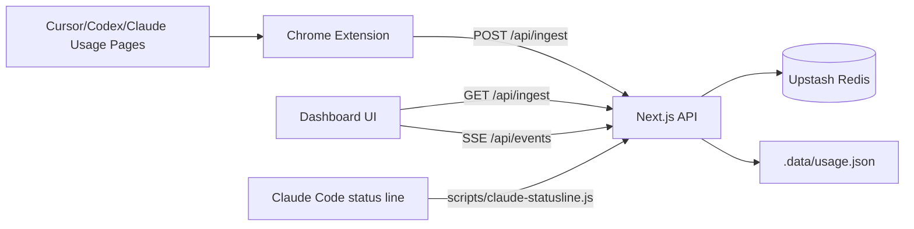

# AI 使用量メーター

Cursor / Codex / Claude の利用状況を 1 画面で確認するための Next.js ダッシュボードです。

このプロジェクトは、公式の従量課金 API 連携ではなく、各サービスの usage 画面表示から収集したメトリクスを集約して表示します。

## スクリーンショット

AI 使用量メーターのダッシュボード画面

## 主な機能

- 複数サービスの usage を単一ダッシュボードで確認
- Chrome 拡張による定期収集（約1分間隔）
- `POST /api/ingest` でメトリクス取り込み
- `GET /api/events` (SSE) によるリアルタイム更新
- 任意で Upstash Redis 永続化
- 任意で Claude Code status line (`rate_limits`) 取り込み

## 技術スタック

- Frontend / Backend: Next.js 16, React 19, TypeScript
- Styling: Tailwind CSS 4
- Storage: Upstash Redis（任意） / `.data/usage.json`（ローカルフォールバック）
- Collector: Chrome Extension (Manifest V3)
- Runtime: Node.js 20+ 推奨

## 構成図




## クイックスタート（ローカル）

```bash
npm install
npm run dev
```

- Dashboard: `http://127.0.0.1:43177`
- Ingest API: `http://127.0.0.1:43177/api/ingest`

## 環境変数

### 基本

```text
NEXT_PUBLIC_DASHBOARD_URL=http://127.0.0.1:43177
```

### 本番（Vercel）で推奨

```text
NEXT_PUBLIC_DASHBOARD_URL=https://your-project.vercel.app
COLLECTOR_INGEST_TOKEN=<long-random-token>
```

> `COLLECTOR_INGEST_TOKEN` が未設定の場合、Vercel 環境では collector 系 API が拒否されます。  
> （ローカル開発時のみ未設定を許可）

### サーバー永続化（任意）

```text
UPSTASH_REDIS_REST_URL=...
UPSTASH_REDIS_REST_TOKEN=...
```

- Redis 未設定時:
  - ローカル: `.data/usage.json` に保存
  - Vercel: サーバー永続化なし（拡張のローカルストア主体）

## Chrome 拡張（Web Collector）セットアップ

`collector-extension` を unpacked extension として読み込みます。

1. `chrome://extensions` を開く
2. デベロッパーモードを有効化
3. 「パッケージ化されていない拡張機能を読み込む」
4. `collector-extension` ディレクトリを選択
5. 拡張機能の「オプション」を開く
6. `Dashboard URL` を設定
  - ローカル: `http://127.0.0.1:43177`
  - Vercel: `https://your-project.vercel.app`
7. `Collector Token` は `COLLECTOR_INGEST_TOKEN` と同じ値を設定（本番推奨）
8. 以下のページでログイン状態を確認
  - `https://cursor.com/ja/dashboard/spending`
  - `https://chatgpt.com/codex/cloud/settings/analytics#usage`
  - `https://claude.ai/settings/usage`

## Claude Code status line 連携（任意）

`scripts/claude-statusline.js` は標準入力 JSON の `rate_limits` を抽出し、`/api/ingest` に送信します。

```bash
node ./scripts/claude-statusline.js
```

Vercel に送る場合:

```bash
AI_USAGE_DASHBOARD_URL=https://your-project.vercel.app/api/ingest
AI_USAGE_DASHBOARD_TOKEN=<same-as-COLLECTOR_INGEST_TOKEN>
```

## API エンドポイント（概要）

- `POST /api/ingest`: usage スナップショット取り込み（collector 用）
- `GET /api/ingest`: 現在の usage ストア取得（ダッシュボード表示用）
- `GET /api/events`: SSE で usage 更新を配信
- `GET/POST /api/collector/command`: 拡張への巡回コマンド連携

## セキュリティ運用メモ

- 公開運用では `COLLECTOR_INGEST_TOKEN` を必ず設定
- 拡張の `Dashboard URL` とサーバー側 `NEXT_PUBLIC_DASHBOARD_URL` を一致させる
- `COLLECTOR_DEBUG_RAW=1` は本番で有効化しない
- 可能なら Redis を使い、運用ログ監視を追加

## 開発コマンド

```bash
npm run dev
npm run lint
npm run build
npm run start
```

## 制約と設計方針

Cursor / Codex には、現時点で安定した公開 usage API が十分ではありません。  
そのため本プロジェクトは、DOM 変化に追従しやすい軽量 collector 実装を優先しています。